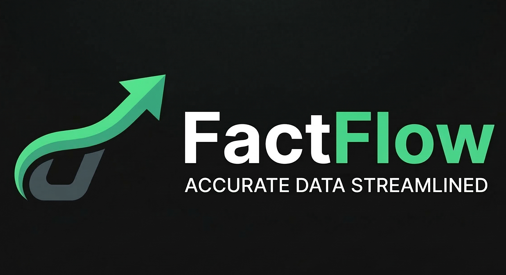

<p align="center">
  
</p>
FactFlow includes an AI-powered article summarization feature using Google Gemini.

When a news article is fetched, the system can generate a short summary on clicking "sumarise" button to help users quickly understand the key information.

Features

✨ Automatic article summarization

⚡ Fast AI responses using Gemini API

🧠 Improves readability for long articles

📄 Can be extended for headline generation and tagging

---
🔑 Gemini API Setup

To enable AI summarization, you need a Gemini API key.

Step 1 — Get API Key

Go to Google AI Studio

Sign in with your Google account

Click Get API Key

Copy your key

---

## 🤖 AI News Summarization

FactFlow includes an **AI-powered article summarization feature** using **Google Gemini**.

When a news article is fetched, the system can automatically generate a **short summary** to help users quickly understand the key information.

### Features

* ✨ Automatic article summarization
* ⚡ Fast AI responses using Gemini API
* 🧠 Improves readability for long articles
* 📄 Can be extended for headline generation and tagging

---

## 🔑 Gemini API Setup

To enable AI summarization, you need a **Gemini API key**.

### Step 1 — Get API Key

1. Go to **Google AI Studio**
2. Sign in with your Google account
3. Click **Get API Key**
4. Copy your key

---

### Step 2 — Enable Gemini API

Make sure the **Gemini API** is enabled in your project inside **Google Cloud Console**.

If you see the error:

```
API key not authorized. Please check your Google API key and ensure Gemini API is enabled.
```

It means:

* The API key is invalid
* The Gemini API is not enabled
* The key restrictions block the request

---

### Step 3 — Add Environment Variable

Add your Gemini API key to `.env.local`:

```
GEMINI_API_KEY=your_google_gemini_api_key
```

Restart the development server after adding the key.

---

### Step 4 — Example Usage

Example AI summarization request:

```javascript
const response = await fetch("/api/summarize", {
  method: "POST",
  body: JSON.stringify({ articleText })
});
```

The API returns a concise summary generated by Gemini.

---


---
## 🧱 Tech Stack

Frontend & Backend

* Next.js
* React
* TypeScript

Database & Auth

* Supabase (PostgreSQL)

Other Tools

* RSS feeds for live news
* GitHub for version control
* Vercel (recommended for deployment)

---

## 📂 Project Structure

```text
src/
│
├── app/
│   ├── api/
│   │   └── articles/
│   │       └── route.ts
│   └── page.tsx
│
├── lib/
│   └── rss.ts
│
└── components/
---

## ⚙️ Environment Variables

Create a `.env.local` file in the root of the project.

```
```env
NEXT_PUBLIC_SUPABASE_URL=your_supabase_project_url
NEXT_PUBLIC_SUPABASE_ANON_KEY=your_public_key
SUPABASE_SERVICE_ROLE_KEY=your_service_role_key
GEMINI_API_KEY=your_google_gemini_api_key

These keys can be obtained from your Supabase dashboard.

---

## 🗄 Database Setup

Create the following tables in Supabase.

### Articles

| Column     | Type      |
| ---------- | --------- |
| id         | uuid      |
| title      | text      |
| content    | text      |
| image_url  | text      |
| created_at | timestamp |

### Categories

| Column | Type |
| ------ | ---- |
| id     | uuid |
| name   | text |
| slug   | text |

---

## 📡 API Endpoints
```
### Get Articles

```
GET /api/articles

```
Optional query parameters:

```
?category=technology
?search=ai
```

### Create Article

```
POST /api/articles


---

## 📰 RSS Integration

FactFlow fetches news from external RSS feeds and merges them with database articles.

This allows the platform to display:

* Internal articles
* External news sources
* Real-time updates

---

## 🛠 Installation
```
Clone the repository:
```
git clone https://github.com/YOUR_USERNAME/FactFlow.git

```
Install dependencies:
```
npm install

```
Run the development server:

```
npm run dev

```
Open:

```
http://localhost:3000

```
---

## 📦 Deployment

The project can be deployed easily using **Vercel**.

Steps:

1. Push the repository to GitHub
2. Import the project into Vercel
3. Add environment variables
4. Deploy

---

## 🧠 Future Improvements

* AI news summarization
* Comment system
* Bookmark articles
* User dashboard
* Trending news detection

##
